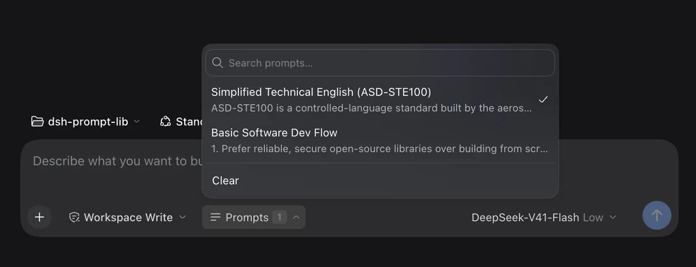
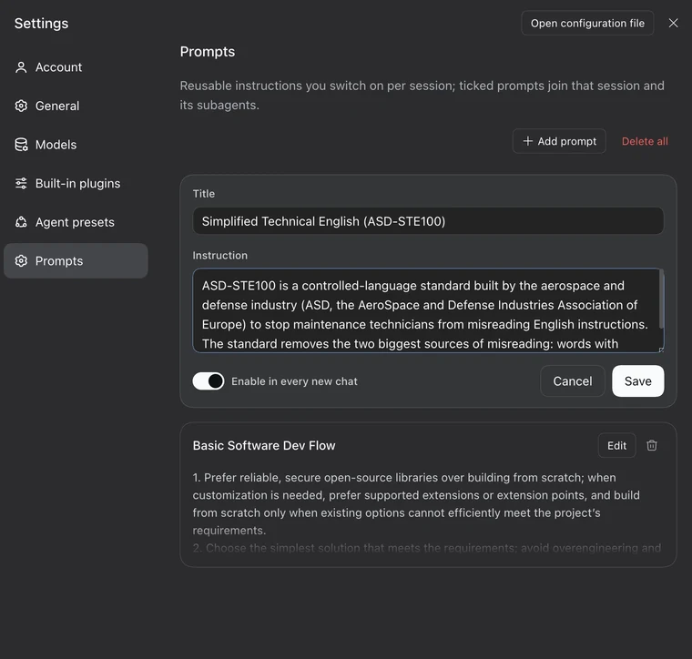

# @stmol/dsh-prompt-lib

🥷 Keep your own prompts inside [DeepSeek Harness](https://github.com/deepseek-ai/deepseek-harness), and switch them on for a chat in one click.

- **Settings → Prompts**: write, edit and delete your prompts.
- **Chat composer**: tick the ones you want for this session. The button shows how many are on.

A prompt that is ticked applies to every model step of that session, and to the subagents it starts.

<p align="center">
  <br>
</p>

<p align="center">
  <br>
</p>

## Install

Published on npm as [`@stmol/dsh-prompt-lib`](https://www.npmjs.com/package/@stmol/dsh-prompt-lib).
Any bundle source works: the npm package, the [repository](https://github.com/Stmol/dsh-prompt-lib), a tarball, or a local folder.

- **GUI:** Settings → Plugins → Add plugin, then `@stmol/dsh-prompt-lib`.
- **CLI:** `dsh plugin add @stmol/dsh-prompt-lib`.

Restart DSH after the first install; later edits reach the running app through HMR. There are no automatic updates: remove the plugin and add it again.

<details>
<summary>Install from a local checkout</summary>

```bash
dsh plugin add link:/path/to/dsh-prompt-lib
```

A linked checkout keeps its own `node_modules`, so the plugin's one dependency has to be installed there too:

```bash
cd /path/to/dsh-prompt-lib && npm install
```

Without it the plugin fails to load and nothing appears in Settings.

</details>

## Usage

1. Open **Settings → Prompts**. It is its own page, after *Agent presets*. Write a title and an instruction, then save.
   - The title is a label for you. The list, the search field and the composer picker use it to keep prompts findable. It is never sent to the model, only the instruction text is.
   - The instruction is stored in the plugin's config, so it survives restarts and is there in every session.
   - **Enable in every new chat** marks the prompt as a default. It is off unless you turn it on.
2. In a chat, open the **Prompts** control in the composer tool row, right of the permissions dropdown. Tick what you want. The button shows the count.
3. The ticks apply from the next model step. No restart and no new session needed. Tick again, or press **Clear**, to take them out.

Prompts are matched by an id generated behind the scenes, not by title, so renaming a prompt keeps every session pointed at it.

### Defaults for new chats

A prompt can be set to start enabled. Every session that has never been ticked by hand opens with those defaults already on, and the picker shows them ticked, so the count on a fresh chat matches what that chat will use.

The first hand edit to a session, whether that is ticking, unticking or **Clear**, becomes that session's own choice and takes over from then on. Unticking the last default prompt records "none here" instead of falling back to the defaults you just removed.

### Subagents

A session that has ticks of its own uses exactly those, and an empty list counts as a choice. A session with no choice at all takes the choice of the nearest ancestor session, so a subagent inherits from the chat that started it. Only a whole line with no choice anywhere falls back to the defaults for new chats.

## Good to know

- **The settings file must be writable.** The Prompts page says so up front and disables its controls. In the composer, a write the host refuses shows the reason under the list, so an edit is never dropped silently.
- **The composer control hides itself** until the settings remote is mounted and has answered its first read, rather than show a count that is about to change.
- **There are size limits.** The editor caps one instruction at 8000 characters. The host applies that same cap, uses at most 100 prompts and reads at most 500 library entries when it renders. Anything past those limits contributes nothing to the model. Settings still shows, edits and keeps every entry.
- **Selections accumulate.** The plugin keeps one entry per session that has ever been ticked in, and never prunes them. An entry whose prompts were all deleted still means "inject nothing", so removing it would quietly bring back the defaults for that session.
